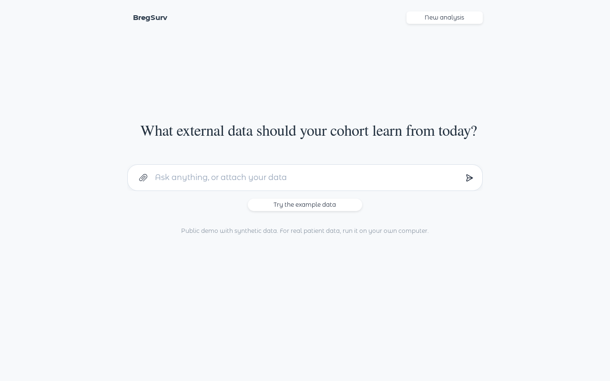
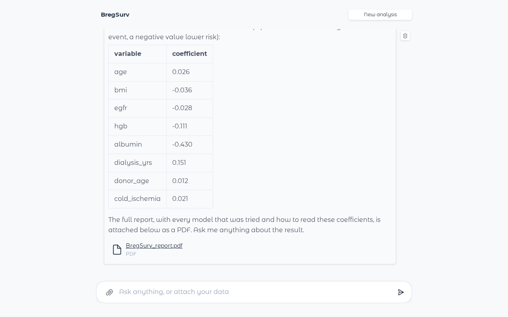
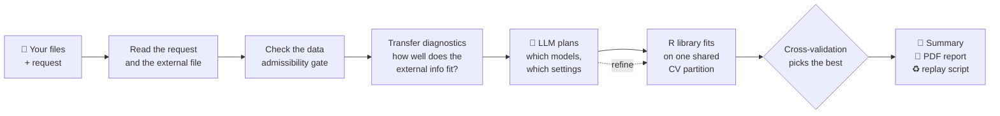

<div align="center">

# 🧬 BregSurv Agent

**A local AI agent for survival analysis that learns from external data — published models or other cohorts — and only when it helps.**

[](https://huggingface.co/spaces/anon-bregsurv/BregSurv)
[](https://www.r-project.org/)
[](https://www.python.org/)
[-6f42c1)](https://huggingface.co/Qwen/Qwen3-8B-AWQ)
[](LICENSE.md)


<sub>▶️ Full demo video: <a href="assets/demo.mp4">assets/demo.mp4</a></sub>

</div>

---

## 📖 Overview

You have a **cohort** — a few hundred patients from your hospital — and someone else has **more data**: a published risk model from a national registry, or another centre's patient records. Borrowing from that external information can make your survival analysis far more precise. Borrowing blindly can also make it worse, because the external population is never quite yours.

**BregSurv Agent** does this analysis for you from a single sentence:

> *"Follow-up is in `followup_days`, `died` is 1 when the patient died. Adjust for age, BMI, eGFR, haemoglobin, albumin, dialysis years, donor age and cold ischaemia time. We also have coefficients from a registry model — borrow from them if that helps."*

It reads your request and your files, checks how well the external information fits your data, plans which analyses are worth running, fits them, and lets cross-validation decide — including the two honest baselines, **your data alone** and **the external model as it is**. You get a plain-language answer in the chat and a full PDF report.

🔒 **Everything runs on your own machine.** The language model (Qwen3-8B) is served locally; no patient row ever leaves your computer, and no external API is called.

---

## ✨ Why BregSurv Agent?

| | |
|---|---|
| 🎯 **Borrows only when it helps** | Your data alone and the external model unchanged are always in the comparison, so the agent can — and does — tell you when borrowing does *not* pay. |
| 🧠 **The LLM plans, the statistics decide** | The model reads diagnostics of how your data and the external information agree and plans the analysis; a verified R estimator library fits it; cross-validation picks the winner. |
| 🔢 **No number is written by the model** | Every estimate in the chat and the report is inserted from the fitted objects. The model writes words, never digits. |
| ♻️ **Fully reproducible** | Each run ships a script that reproduces the analysis from the R library alone, with no language model involved. |
| 💬 **Made for clinicians** | Drop files into the chat and describe the analysis in your own words. The agent asks only what the data cannot tell it. |
| 🖥️ **Small and local** | An 8B model on a single GPU (≥ 16 GB). No cloud account, no API key, no data transfer. |

---

## 🚀 Quick Start

### Option 1 — Try it online (no installation)

Open the **[Hugging Face Space](https://huggingface.co/spaces/anon-bregsurv/BregSurv)** and click **Try the example data**. The demo uses synthetic data only; for real patient data, run it locally.

### Option 2 — Run it on your own GPU (recommended for real data)

You need [Docker](https://docs.docker.com/get-docker/) with the [NVIDIA Container Toolkit](https://docs.nvidia.com/datacenter/cloud-native/container-toolkit/) and a GPU with at least 16 GB of memory.

```bash
git clone https://github.com/UM-KevinHe/BregSurv.git
cd BregSurv
docker build -t bregsurv-agent .
docker run --gpus all -p 7860:7860 bregsurv-agent
```

Open **http://localhost:7860**. The first start takes a few minutes while the model loads. The same chat interface as the online demo runs entirely on your machine — your data stays there.

### Option 3 — Use the R package directly

The estimator library behind the agent is a standalone R package:

```r
# install.packages("remotes")
remotes::install_github("UM-KevinHe/BregSurv")
library(BregSurv)
?coxkl          # Kullback–Leibler borrowing from published coefficients
?cox_MDTL       # Mahalanobis-distance borrowing (with or without a covariance)
?cox_indi       # borrowing from another cohort's individual-level records
```

---

## 💬 How a conversation goes

1. **Drop your files** into the message box (📎): your cohort (`.csv`, `.xlsx`, `.rds`, …) and, optionally, the external information — a coefficient table, a JSON with coefficients and covariance, a baseline-hazard table, or another cohort's records. A second file with the same columns can be your **test set**.
2. **Say what you want** in plain words. Name the follow-up time, the event, and what to adjust for.
3. **Watch it work.** The chat shows each step as it happens:

   ```
   ✓ Reading your request
   ✓ Finding the columns you named
   ✓ Checking your data
   ✓ Checking how well the external data fits your cohort
   ✓ Planning which models to fit
   ✓ Fitting the planned models
   ✓ Comparing the models and choosing the best
   ✓ Writing the report
   ```

4. **Read the answer.** A short summary in the chat — what was compared, whether borrowing helped, and the coefficients of the recommended model — with the **full PDF report** attached.
5. **Ask follow-up questions** — *"Why was that model chosen instead of just using my own data?"* — and get plain-language answers grounded in the fitted results.

<div align="center">
 &nbsp; 
</div>

---

## 🧭 How it works



* **The harness gathers, the model decides.** Deterministic code profiles your data, verifies every reading against your own words and your file, and computes the diagnostics. The language model uses them to plan *what* to fit; it never sets a number.
* **Every plan is checked.** Only analyses the data admit can be fitted, the two do-not-borrow baselines are always included, and a fixed computing budget bounds the plan.
* **Cross-validation decides**, on one partition shared by every candidate, so the comparison is fair.

---

## 🧪 What it can analyse

| | Coefficients | Coefficients + covariance | Coefficients + baseline hazard | Another cohort's records | No external data |
|---|:---:|:---:|:---:|:---:|:---:|
| **Full cohort (Cox)** | ✅ | ✅ | ✅ ¹ | ✅ | ✅ |
| **Nested case–control (matched sets)** | ✅ | ✅ | — | ✅ | ✅ |
| **Discrete-time follow-up** | — ² | — | ✅ | — | ✅ |

¹ The coefficients are used; the baseline hazard is used only for discrete-time follow-up.  
² Borrowing on a discrete time grid needs the external baseline hazard.

Also supported: tied event times (Breslow correction), stratified cohorts, ridge and lasso penalties, a separate test set you supply, and — on request — evaluation over repeated random train/test splits with box plots.

---

## 📁 Repository layout

```
BregSurv/
├── app.py               # the chat interface (Gradio)
├── bregsurv_agent/      # the agent: reading, planning, checks, reports
├── mcp/r_scripts/       # the R side of the agent (profiling, fitting, diagnostics)
├── R/ src/ man/ data/   # the BregSurv R package (estimator library)
├── demo/                # synthetic example data
├── tests/               # test suites
├── deploy/              # files for the Hugging Face Space
└── Dockerfile           # one-command local deployment
```

---

## 📚 Citation

If you use BregSurv or BregSurv Agent, please cite the accompanying paper (citation to be added).

## 📄 License

GPL-3. See [LICENSE.md](LICENSE.md). The bundled `DiscreteKL` package (Di Wang) is GPL (≥ 2).

## ✉️ Contact

Questions and issues: please open a [GitHub issue](https://github.com/UM-KevinHe/BregSurv/issues).
