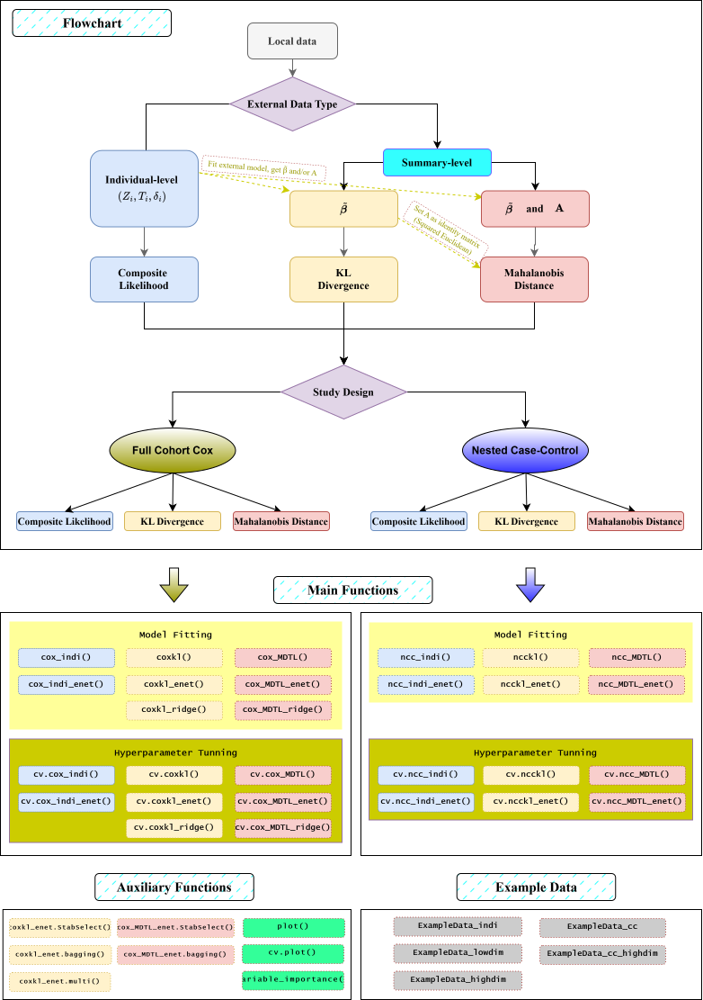

<div id="main" class="col-md-9" role="main">

# BregSurv: Bregman Divergence Data Integration for Time-to-Event Modelling

<div class="section level2">

## 1. Introduction

The `BregSurv` package implements a Bregman-divergence-based transfer
learning framework for survival analysis, enabling principled borrowing
of external information while explicitly accommodating population
heterogeneity between the internal study and external sources.

<div class="section level3">

### Key Features

**Three external data integration modes**  
Depending on the type of external data available, the package supports:

-   **Individual-level data**: when full covariate and outcome data from
    an external cohort are accessible, integration is performed via a
    weighted pseudo-likelihood framework.

-   **Coefficient-level summaries**: when only external regression
    coefficients $\\widetilde{\\mathbf{\\beta}}$ or external risk scores
    $r(Z,\\widetilde{\\mathbf{\\beta}})$ are available, integration
    proceeds via Kullback–Leibler divergence penalization.

-   **Coefficient + curvature summaries**: when
    $\\widetilde{\\mathbf{\\beta}}$ or
    $r(Z,\\widetilde{\\mathbf{\\beta}})$ are available, with an
    additional positive semidefinite matrix **A** (e.g., information
    matrix or variance–covariance matrix) is provided, integration
    proceeds via Mahalanobis distance penalization.

    *Note: These three modes are not mutually exclusive. If
    individual-level external data are available, one may first fit an
    external model to obtain $\\widetilde{\\mathbf{\\beta}}$ (and
    optionally **A**), then proceed with KL or Mahalanobis integration.
    Conversely, if only $\\widetilde{\\mathbf{\\beta}}$ is available
    without curvature information, setting **A** = **I** reduces the
    Mahalanobis distance to the squared Euclidean distance, making the
    Mahalanobis framework applicable in this setting as well.*

**Two study design frameworks**  
The package supports two primary study designs for time-to-event
analysis: - **Full-cohort Cox models**: standard Cox proportional
hazards regression using the complete cohort, suitable when all
subjects’ follow-up and covariate data are available. See the [Cox model
vignette](#sec_cox) for details. - **Nested case–control (NCC)
designs**: conditional logistic regression on sampled risk sets,
appropriate when covariate collection is resource-intensive and only a
subset of controls are sampled per case. See the [NCC vignette](#sec_cc)
for details.

**Robustness to clustered data**  
Real-world survival data often exhibit between-cluster heterogeneity due
to multi-site enrollment, matched case-control designs, or hierarchical
sampling structures. Ignoring such clustering can lead to biased hazard
ratio estimates and invalid standard errors. The package addresses this
issue through stratified partial likelihoods, which allow the baseline
hazard function to vary freely across strata rather than imposing a
common baseline.

**Robustness to tied event times**  
Tied event times frequently arise when follow-up is recorded on a coarse
time scale, such as daily records, scheduled clinical visits, or
discretized follow-up intervals. Direct application to heavily tied data
on the standard Cox partial likelihood (which assumes a continuous time
scale with no ties) can produce biased estimates due to incorrect
probability construction. The package incorporates tie-correction
methods—including the Breslow and Efron approximations—to adjust the
risk set contributions at tied event times and restore the validity of
partial likelihood inference.

**High-dimensional variable selection** Penalized estimation with ridge,
lasso, and elastic net penalties is supported for variable selection and
shrinkage, with tuning parameters selected via cross-validation by
default. However, cross-validation optimizes predictive performance
rather than variable selection stability, and the selected predictor set
can vary across repeated runs or minor data perturbations. For users who
need a reproducible and trustworthy shortlist of important predictors,
the package provides a stability selection-based variable importance
feature that identifies predictors consistently selected across
resampled datasets.

**Ensemble integration via bagged estimation**  
The package supports an ensemble strategy that combines bootstrapping,
external-data integration, and model aggregation. This bagged
integration approach reduces variance and improves predictive robustness
compared to relying on a single cross-validated integrated model.

**Flexible cross-validation criteria**  
Model tuning supports a broad range of cross-validation criteria.
Discrimination- based measures include Harrell’s concordance index
(C-index) (Harrell et al. 1982), and partial likelihood–based criteria
include the Verweij & Van Houwelingen (V&VH) loss and the
cross-validated linear predictor loss. For full details on each
criterion, see **Appendix: CV Criteria**.

**Pathwise solution for integration weights**  
To select the integration weight *η* that governs the strength of
external borrowing, the package provides two complementary tuning
strategies: (i) a grid search approach based on a pre-specified sequence
of candidate values, and (ii) an adaptive tuning strategy using Bayesian
optimization to directly explore the integration weight space, which is
particularly efficient when evaluating each candidate is computationally
expensive.

</div>

<div class="section level3">

### Package Workflow

The following flowchart illustrates the overall workflow of the
`BregSurv` package. Users first choose an integration strategy based on
the type of external information available, then select a study design
(full-cohort Cox model or nested case–control). The package supports
both low-dimensional estimation and high-dimensional penalized
regression, with a suite of cross-cutting features applicable across
methods. 

------------------------------------------------------------------------

This vignette walks through the main functions with worked examples for
each setting. The package supports coefficient estimation for
low-dimensional settings and variable selection for high-dimensional
settings, illustrated using the example datasets included in the
package.

-   For Cox proportional hazards model data integration, see Section
    [Cox Proportional Hazards Model Data Integration](#sec_cox).
-   For nested case–control designs, see Section [(Nested) Case-Control
    Data Integration](#sec_cc).

</div>

<div class="section level3">

### Installation

You can install the package from CRAN:

<div id="cb1" class="sourceCode">

``` r
install.packages("BregSurv")
```

</div>

Or install the development version from GitHub:

<div id="cb2" class="sourceCode">

``` r
remotes::install_github("UM-KevinHe/BregSurv", ref = "main")
```

</div>

<div id="cb3" class="sourceCode">

``` r
library(BregSurv)
```

</div>

</div>

</div>

<div class="section level2">

## 2. Cox Proportional Hazards Model

Depending on the type of external data available, the framework supports
three broad methodological settings, each implemented through a
corresponding set of functions:

1.  [Individual-Level External Data (via composite
    likelihood)](#sec_indi) When individual-level external data are
    accessible (e.g., for time-to-event outcomes, the user has
    covariates, survival outcomes, and follow-up times from an external
    cohort), the software provides the function such as `cox_indi()` and
    related downstream utilities. These functions implement data
    integration through a composite likelihood framework (Wang and Zidek
    2005; Gao and Carroll 2017).

2.  [Summary-level External Coefficients / risk scores (via KL
    divergence)](#sec_coxkl) When only summary-level regression
    coefficients $\\widetilde{\\mathbf{\\beta}}$ or external risk scores
    $r(\\mathbf{Z},\\widetilde{\\mathbf{\\beta}})$ are available, the
    user can perform data integration via the Kullback–Leibler
    divergence.

3.  [Summary-level External Coefficients / risk scores + Curvature (via
    Mahalanobis distance)](#sec_coxmaha) When
    $\\widetilde{\\mathbf{\\beta}}$ or
    $r(\\mathbf{Z},\\widetilde{\\mathbf{\\beta}})$ are available along
    with a positive semidefinite matrix **A** (e.g., information or
    variance–covariance matrix), the user can perform data integration
    via the quadratic Mahalanobis distance.

*Note: These three settings are not mutually exclusive. If
individual-level external data are available, one may first fit an
external model to obtain $\\widetilde{\\mathbf{\\beta}}$ (and optionally
**A**), then proceed with KL or Mahalanobis integration. Conversely, if
only $\\widetilde{\\mathbf{\\beta}}$ is available without curvature
information, setting **A** = **I** reduces the Mahalanobis distance to
the squared Euclidean distance, making the Mahalanobis framework
applicable in this setting as well.*

Throughout all three settings, the **stratified model** is the default
implementation. The conventional non-stratified model, which assumes a
shared baseline hazard for all observations, is treated as a special
case obtained by assigning all subjects to a single stratum.

<div class="section level3">

### 2.1 Individual-Level External Data Integration (via composite likelihood)

When individual-level data are available for both the internal and
external cohorts, the function `cox_indi()` fits a Cox proportional
hazards model that integrates information from both datasets via a
weighted pseudo-likelihood approach. To use this integration approach,
the user must provide at least the covariate matrices, event indicators,
and event time for both internal and external cohort.

We provide a toy example to illustrate the use of the software based on
the built-in dataset `ExampleData_indi`. This dataset contains example
time-to-event data from both internal and external sources, including
the covariate matrices, stratum information, event indicators, and event
times.

<div id="cb4" class="sourceCode">

``` r
data(ExampleData_indi)

z_int       <- ExampleData_indi$internal$z
delta_int   <- ExampleData_indi$internal$status
time_int    <- ExampleData_indi$internal$time
stratum_int <- ExampleData_indi$internal$stratum

z_ext       <- ExampleData_indi$external$z
delta_ext   <- ExampleData_indi$external$status
time_ext    <- ExampleData_indi$external$time
stratum_ext <- ExampleData_indi$external$stratum
```

</div>

The function `cox_indi()` fits a sequence of weighted stratified Cox
models that integrate the internal and external datasets through a list
of integration weights *η*, which governs the degree of information
borrowing (via function argument `etas`):

-   *η* = 0 corresponds to the standard Cox model with no external
    contribution, and  
-   larger values of *η* increasingly pull the estimated coefficients
    toward the external information.

The user should rely on prior knowledge or problem-specific
considerations to determine an appropriate range of *η*’s.

<div id="cb5" class="sourceCode">

``` r
eta_list <- generate_eta(method = "exponential", n = 50, max_eta = 100)

fit.cox_indi <- cox_indi(
  z_int = z_int,
  delta_int = delta_int,
  time_int = time_int,
  stratum_int = stratum_int,
  z_ext = z_ext,
  delta_ext = delta_ext,
  time_ext = time_ext,
  stratum_ext = stratum_ext,
  etas = eta_list
)
```

</div>

For hyperparameter tuning of *η*, we aim to select the value of *η* that
yields the best predictive performance. We adopt cross-validation and
consider four criteria: two based on Harrell’s C-index (Harrell et al.
1982)—`CIndex_pooled` and `CIndex_foldaverage`—and two loss-based
criteria—`LinPred` and `V&VH`. For cross validation methods details,
please refer to Page: **Appendix: CV Criteria**.

We provide an example illustrating the use of the cross-validation
function `cv.cox_indi()` under the `V&VH` criterion.

<div id="cb6" class="sourceCode">

``` r
cvfit.cox_indi <- cv.cox_indi(
  z_int = z_int,
  delta_int = delta_int,
  time_int = time_int,
  stratum_int = stratum_int,
  z_ext = z_ext,
  delta_ext = delta_ext,
  time_ext = time_ext,
  stratum_ext = stratum_ext,
  etas = eta_list,
  nfolds = 5,
  cv.criteria = "V&VH"
)
```

</div>

</div>

<div class="section level3">

### 2.2 Summary-level External Coefficients / risk scores (via Kullback–Leibler Divergence)

External individual-level data are often inaccessible due to data
governance, privacy regulations, or institutional agreements; only
summary-level information may be available from the external source,
typically in the form of estimated regression coefficients
$\\widetilde{\\mathbf{\\beta}}$ or an external risk score
$r(Z,\\widetilde{\\mathbf{\\beta}})$. In such cases, data integration
can be carried out through a Kullback–Leibler divergence formulation.
The minimal input required for this approach is
$\\widetilde{\\mathbf{\\beta}}$, corresponding to the coefficient
estimates obtained from the external model, or the external risk score.
For methodology details, please refer to Page: **Appendix: Cox KL
Divergence**.

We present the usage of the functions for
[low-dimensional](#sec_coxkl_low) and
[high-dimensional](#sec_coxkl_high) settings separately. Across all
implementations, the `stratum` argument controls between-stratum
heterogeneity; when no stratum information is provided, all subjects are
automatically assigned to a single stratum.

<div class="section level4">

#### Low-Dimensional Integration

We begin with **low-dimensional** settings, where the number of
predictors is modest. Similarly, we provide a built-in low-dimensional
simulated dataset `ExampleData_lowdim`, which consists of a training set
(100 samples) and a test set (2000 samples) with six predictors. We
first extract the training components:

<div id="cb7" class="sourceCode">

``` r
data(ExampleData_lowdim)

train  <- ExampleData_lowdim$train
test   <- ExampleData_lowdim$test

z      <- train$z
delta  <- train$status
time   <- train$time
strat  <- train$stratum
```

</div>

The corresponding built-in external regression coefficients
$\\widetilde{\\mathbf{\\beta}}$ can be obtained as follows:

<div id="cb8" class="sourceCode">

``` r
beta_ext <- ExampleData_lowdim$beta_external_fair
```

</div>

To fit the KL divergence–based integrated model, we first generate a
suitable range of integration weights *η* using the function
`generate_eta()`. The user should rely on prior knowledge or
problem-specific considerations to determine an appropriate range. We
then use the function `coxkl()` to fit the model. The external
regression coefficient $\\widetilde{\\mathbf{\\beta}}$ is supplied to
the function through the argument `beta =`.

<div id="cb9" class="sourceCode">

``` r
eta_list <- generate_eta(method = "exponential", n = 50, max_eta = 10)

fit.coxkl <- coxkl(
  z = z,
  delta = delta,
  time = time,
  stratum = strat,
  beta = beta_ext,
  etas = eta_list
)
```

</div>

Alternatively, instead of providing $\\widetilde{\\mathbf{\\beta}}$,
users may supply an external risk score vector via the argument `RS =`:

<div id="cb10" class="sourceCode">

``` r
RS_ext <- as.matrix(z) %*% as.matrix(beta_ext)

fit.coxkl.RS <- coxkl(
  z = z,
  delta = delta,
  time = time,
  stratum = strat,
  RS = RS_ext,
  etas = eta_list
)
```

</div>

The function `cv.coxkl()` performs *K*-fold cross-validation (default
*K* = 5) to select the integration parameter in the KL-integrated Cox
model. We consider four criteria: two based on Harrell’s C-index
(Harrell et al. 1982)—`CIndex_pooled` and `CIndex_foldaverage`—and two
loss-based criteria—`LinPred` and `V&VH`. For details, please refer to
Page: **Appendix: CV Criteria**. Below is an example using the default
`"V&VH"` criterion:

<div id="cb11" class="sourceCode">

``` r
cvfit.coxkl <- cv.coxkl(
  z = z,
  delta = delta,
  time = time,
  stratum = strat,
  beta = beta_ext,
  etas = eta_list,
  nfolds = 5,
  cv.criteria = "V&VH",
  seed = 1)
```

</div>

The cross-validated performance curve from hyperparameter tuning
functions `cv.coxkl()` can be visualized directly using `cv.plot()`:

<div id="cb12" class="sourceCode">

``` r
cv.plot(cvfit.coxkl)
```

</div>

-   The solid purple curve displays the cross-validated loss across
    different values of *η*.
-   The green dotted horizontal line marks the internal baseline at *η*
    = 0, representing the model that does not incorporate external
    information.
-   The vertical dashed orange line indicates the optimal *η* value,
    where the cross-validated loss is minimized.

A comparison between the purple curve and the green baseline shows
whether borrowing external information improves prediction performance.
Whenever the purple curve falls below the green line, using external
information (*η* &gt; 0) yields better predictive accuracy than relying
solely on the internal model.

For datasets containing **tied** event times, users can apply the
`coxkl_ties()` and `cv.coxkl_ties()` function, which extends the KL
integrated Cox model to explicitly accommodate ties. The function allows
users to choose between the “breslow” (Breslow 1974) and “exact” (Cox
1972) methods for tie handling. The Breslow method provides a
computationally efficient approximation and is generally suitable when
the number of tied events is moderate, whereas the exact method yields
more accurate inference in the presence of extensive ties at the cost of
increased computational burden. The following example demonstrates the
use of the Breslow method. For methodology details, please refer to
Page: **Appendix: Cox KL: Tied Event Times**.

<div id="cb13" class="sourceCode">

``` r
time_ties <- round(time, 2)   # Rounding time introduces ties for demonstration

fit.coxkl.ties <- coxkl_ties(
  z = z,
  delta = delta,
  time = time_ties,
  stratum = strat,
  beta = beta_ext,
  etas = eta_list,
  ties = "breslow"
)
```

</div>

</div>

<div class="section level4">

#### High-Dimensional Integration

In high-dimensional regimes—such as when the number of predictors is
comparable to or exceeds the sample size—the `BregSurv` package extends
KL divergence–integrated Cox modeling with regularization.

Two families of penalties are implemented:

-   **Ridge penalty (ℓ₂)**, via `coxkl_ridge()` and related downstream
    functions, which shrinks coefficients toward zero while yielding
    dense solutions.
-   **LASSO penalty (ℓ₁)** and **Elastic net penalty (a mixture of ℓ₁
    and ℓ₂)**, via `coxkl_enet()` and related downstream functions, to
    enable sparse variable selection.

In addition to the integration weight *η*, which determines the extent
of information borrowed from external sources, the high-dimensional
functions involve a **regularization parameter** *λ* ≥ 0 that governs
the strength of regularization. The parameter *α* ∈ \[0, 1\] is a mixing
coefficient that controls the relative contribution of the ℓ₁ (LASSO)
and ℓ₂ (Ridge) components.

The built-in high-dimensional simulated dataset `ExampleData_highdim`
contains a training set (200 samples) and a test set (2000 samples). The
dataset includes 50 predictors (`Z1`–`Z50`), of which 6 are signal
variables and the remaining 44 are AR(1) noise variables. Externally
derived coefficients are provided in `beta_external`:

<div id="cb14" class="sourceCode">

``` r
data(ExampleData_highdim)

train_hd  <- ExampleData_highdim$train
test_hd   <- ExampleData_highdim$test

z_hd      <- train_hd$z
delta_hd  <- train_hd$status
time_hd   <- train_hd$time
strat_hd  <- train_hd$stratum

beta_external_hd <- ExampleData_highdim$beta_external
```

</div>

The function `coxkl_ridge()` fits a KL-integrated Cox model with a Ridge
(L2) penalty on all predictors. External information is incorporated
through a KL-based integration term weighted by *η* (a user-specified
scalar), while regularization is imposed through a sequence of tuning
parameters *λ*. If *λ* is not provided, the function automatically
generates a decreasing lambda path.

We begin by fitting a KL–ridge model for a fixed integration weight *η*
using an automatically generated lambda sequence:

<div id="cb15" class="sourceCode">

``` r
fit.coxkl_ridge <- coxkl_ridge(
  z        = z_hd,
  delta    = delta_hd,
  time     = time_hd,
  stratum  = strat_hd,
  beta     = beta_external_hd,
  eta      = 1                 
)
```

</div>

The fitted object stores, for each value of *λ*:

-   `$lambda` — the sequence of lambda values (in decreasing order),
-   `$beta` — estimated coefficients (one column per lambda),
-   `$linear.predictors` — linear predictors for all observations across
    the lambda path,
-   `$likelihood` — partial log-likelihood along the lambda path,
-   `$data` — the data used for fitting.

The function `coxkl_enet()` fits a KL-integrated Cox model with an
elastic-net penalty, controlled by the mixing parameter `alpha`. When
`alpha = 1`, the penalty reduces to *LASSO*, introducing coefficient
sparsity in addition to KL-based integration of external information.
Similar, the penalty parameter *λ* controls sparsity. If *λ* is not
provided, the function automatically generates a decreasing lambda
sequence.

Below, we illustrate the workflow using the *LASSO* special case
(`alpha = 1`) with an automatically generated lambda path:

<div id="cb16" class="sourceCode">

``` r
fit.coxkl_LASSO <- coxkl_enet(
  z        = z_hd,
  delta    = delta_hd,
  time     = time_hd,
  stratum  = strat_hd,
  beta     = beta_external_hd,   
  eta      = 1,                 
  alpha    = 1                  # LASSO penalty
)
```

</div>

The fitted object stores, for each lambda value:

-   `$lambda` — the lambda sequence (in decreasing order),
-   `$beta` — estimated coefficients (one column per lambda),
-   `$likelihood` — partial log-likelihood along the lambda path,
-   `$data` — the data used for fitting.

Objects from `coxkl_ridge()` or `coxkl_enet()` functions can be
visualized using the S3 plotting method `plot()`:

This plots (at given *η*):

-   Loss or C-index versus the penalty parameter *λ*,
-   x-axis on a reversed log10 scale (larger penalties on the left,
    smaller penalties on the right),
-   y-axis labeled as loss or C-index,.
-   A vertical dashed orange line marks the optimal value of λ, where
    the loss reaches its minimum on the evaluated grid.

<div id="cb17" class="sourceCode">

``` r
plot(
  fit.coxkl_LASSO,
  test_z       = test_hd$z,
  test_time    = test_hd$time,
  test_delta   = test_hd$status,
  test_stratum = test_hd$stratum,
  criteria     = "loss"
)
```

</div>

For penalized KL-integrated models, the functions `cv.coxkl_ridge()` and
`cv.coxkl_enet()` perform K-fold cross-validation to tune the
integration parameter *η*, while internally scanning over a *λ* path for
each candidate *η*. For each value of *η*, the cross-validation
procedure:

-   evaluates a sequence of ridge or elastic-net penalties *λ*,
-   computes the chosen cross-validation criterion on the held-out
    folds,
-   selects the best *λ* for that *η*,
-   aggregates the performance across folds into summary tables.

The supported criteria also include two based on Harrell’s C-index
(Harrell et al. 1982)—`CIndex_pooled` and `CIndex_foldaverage`—and two
loss-based criteria—`LinPred` and `V&VH`. For details, please refer to
Page: **Appendix: CV Criteria**.

Below we demonstrate tuning *η* using 5-fold cross-validation and the
`V&VH` criterion for the LASSO-penalized integrated model (`alpha = 1`).
The range of integration weights *η* can be generated by using the
function `generate_eta()`. The user should rely on prior knowledge or
problem-specific considerations to determine an appropriate range. (For
ridge, use `cv.coxkl_ridge()` analogously.)

<div id="cb18" class="sourceCode">

``` r
eta_grid_hd <- generate_eta(method = "exponential", n = 50, max_eta = 50)

cvfit.coxkl_LASSO <- cv.coxkl_enet(
  z = z_hd,
  delta = delta_hd,
  time = time_hd,
  stratum = strat_hd,
  beta = beta_external_hd,
  etas = eta_grid_hd,
  alpha = 1, # LASSO
  nfolds = 5,
  cv.criteria = "V&VH",
  seed = 1
)
```

</div>

The best *λ* for each *η* (according to the chosen criterion) is
provided by:

<div id="cb19" class="sourceCode">

``` r
head(cvfit.coxkl_LASSO$integrated_stat.best_per_eta)
```

</div>

The helper function `cv.plot()` can be used to visualize performance
versus *η*:

<div id="cb20" class="sourceCode">

``` r
cv.plot(cvfit.coxkl_LASSO)
```

</div>

The resulting plot displays:

-   a purple curve showing the cross-validated performance across the
    *η* sequence (loss or C-index),
-   a green dotted horizontal line indicating the internal baseline at
    *η* = 0,
-   a green point marking the baseline performance,
-   and a vertical dashed orange line denoting the optimal *η*, where
    the cross-validated loss attains its minimum.

</div>

<div class="section level4">

#### Variable Importance and Stability Selection

For high-dimensional integrated models, users are often interested in
identifying predictors that are selected in a stable and reproducible
manner under regularization. The function `variable_importance()`
assesses variable importance using a bootstrap-based refitting strategy
applied to the integrated LASSO or elastic-net models fitted by
`cv.coxkl_enet`. Specifically, the model is repeatedly refit on
bootstrap resamples of the data, and a predictor is recorded as selected
if its estimated coefficient is nonzero in the cross-validated optimal
model. The resulting importance score for each variable is defined as
its selection frequency across bootstrap replications. For machines that
support parallel computing, users can specify the `ncores` argument to
accelerate the computation.

<div id="cb21" class="sourceCode">

``` r
imp.coxkl <- variable_importance(
  z = z_hd,
  delta = delta_hd,
  time = time_hd,
  stratum = strat_hd,
  beta = beta_external_hd,
  etas = eta_grid_hd,
  B = 100,
  ncores = 10
)
```

</div>

After computing variable importance based on bootstrap selection
frequencies, users can further call the generic `plot()` method to
visualize the relative importance of predictors. The `plot()` method
displays selection frequencies ordered from highest to lowest, allowing
users to easily identify variables that are most consistently selected
across bootstrap replications. Optional arguments such as a
selection-frequency threshold and the number of top variables to display
can be used to focus the visualization on the most stable predictors.

<div id="cb22" class="sourceCode">

``` r
plot(imp.coxkl, threshold = 0.6, top = 20)
```

</div>

Classical LASSO tuned via cross-validation performs well for prediction,
but it is often unstable for variable selection: small perturbations of
the data or changes in cross-val idation splits may lead to different
selected subsets, particularly in high-dimensional or correlated
settings. *Stability selection* provides a complementary approach that
emphasizes reproducibility by repeatedly perturbing the data and
recording how frequently each variable is selected across subsamples.

The functions `coxkl_enet.StabSelect()` extend the cross-validated
elastic-net procedures (e.g. `cv.coxkl_enet()`) by repeatedly fitting
the integrated elastic-net model on multiple subsamples (controlled by
the parameter `B`). For each subsample, the model is fit using its own
cross-validated tuning parameters, and the selection status of each
variable along the regularization path is recorded. The function returns
the empirical selection frequency of each variable across resamples and
across the entire penalty path, providing a stability-oriented summary
of variable importance.

<div id="cb23" class="sourceCode">

``` r
coxkl.StabSelect <- coxkl_enet.StabSelect(
  z = z_hd,
  delta = delta_hd,
  time = time_hd,
  stratum = strat_hd,
  beta = beta_external_hd,
  etas = eta_list,
  cv.criteria = "CIndex_pooled",
  B = 100,
  ncores = 10
)
```

</div>

Objects returned by `coxkl_enet.StabSelect()` can be visualized using
the S3 plotting method `plot()`. The x-axis corresponds to the penalty
parameter *λ* on a reversed log10 scale, and the y-axis shows the
selection frequency—a continuous measure of relative variable
importance. Variables with higher selection frequencies are more
consistently retained across resamples, indicating greater importance.
Users may optionally specify a `threshold` (between 0 and 1) to visually
distinguish variables with high importance from the rest.

<div id="cb24" class="sourceCode">

``` r
plot(coxkl.StabSelect, threshold = 0.7)
```

</div>

</div>

<div class="section level4">

#### Bagging for High-Dimensional Models

Besides cross-validated LASSO and stability selection, we additionally
support an ensemble strategy that combines bootstrapping, external-data
integration, and model aggregation. Conceptually similar to bootstrap
aggregation (bagging).

For each bootstrap sample, the integrated model is refit with its own
cross-validated tuning parameters, and the resulting linear predictors
are aggregated across bootstrap replicates. Unlike stability selection,
the goal here is not variable selection, but prediction stabilization:
different bootstrap replicates may recruit different levels of external
borrowing, allowing weak or noisy external signals to be averaged out
rather than over-amplified by a single fit. As a result, this bagged
integration approach reduces variance and improves predictive robustness
compared to relying solely on a single cross-validated integrated LASSO
model.

The functions `coxkl_enet_bagging()` implement this ensemble strategy.
The following example demonstrates how to apply `coxkl_enet_bagging()`
for bagged integration in high-dimensional settings. The function
inherits the arguments of `cv.coxkl_enet()`, with an additional
parameter `B` that controls the number of subsamples used in the
ensemble.

<div id="cb25" class="sourceCode">

``` r
bagging.coxkl <- coxkl_enet_bagging(
  z = z_hd,
  delta = delta_hd,
  time = time_hd,
  stratum = strat_hd,
  beta = beta_external_hd,
  etas = eta_list,
  B = 5,
  seed = 1,
  ncores = 5
)
```

</div>

The returned object contains the bagged coefficient estimate (stored in
`bagging.coxkl$best_beta`) as well as the all bootstrap-specific
estimates (`bagging.coxkl$all_betas`). In practice,
`bagging.coxkl$best_beta` can be treated as the final integrated
elastic-net coefficient vector for downstream analysis; for example,
risk scores on a new design matrix `z_new` can be computed via the
linear predictor `z_new %*% bagging.coxkl$best_beta`, while
`bagging.coxkl$all_betas` can be inspected to assess the variability of
the bootstrap ensemble.

</div>

<div class="section level4">

#### Multi-Source Integration

In many applications, multiple sources of external information may be
available, each providing a distinct set of external coefficient
estimates derived from different studies, populations, or modeling
strategies. Instead of relying on a single external source, it can be
beneficial to integrate information from multiple sources to obtain a
more robust and less source-specific estimate.

The function `coxkl_enet.multi()` fits KL-integrated Cox elastic-net
models using multiple external coefficient vectors. The model is fitted
on the full dataset once for each element in beta\_list, and the
resulting coefficient estimates are combined across sources (e.g., by
averaging) to obtain a single integrated estimate.

<div id="cb26" class="sourceCode">

``` r
beta_list <- list(
  ExampleData_highdim$beta_external,
  ExampleData_highdim$beta_external.multi4,
  ExampleData_highdim$beta_external.multi5
)

multi.out <- coxkl_enet.multi(
  z = z_hd,
  delta = delta_hd,
  time = time_hd,
  stratum = strat_hd,
  beta_list = beta_list,
  etas = eta_grid_hd,
  combine = "mean"
)
```

</div>

The returned object is of class `"coxkl_enet.multi"` and contains the
following key components:

-   `best_beta`: the aggregated coefficient vector, obtained by
    combining the per-source estimates according to the `combine` rule
    (here, `"mean"`).
-   `all_betas`: a matrix of dimension *p* × *K*_(valid) whose columns
    are the coefficient vectors from each successfully fitted source
    model.
-   `valid_sources`: the number of sources that produced a successful
    fit and were included in the aggregation.

</div>

<div class="section level4">

#### Visualising Multi-Source Performance

The `plot()` method for `"coxkl_enet.multi"` objects displays how model
performance varies as a function of the integration parameter *η* for
each external source, overlaid on a single figure.

<div id="cb27" class="sourceCode">

``` r
plot(multi.out,
     test_z       = test_hd$z,
     test_time    = test_hd$time,
     test_delta   = test_hd$status,
     test_stratum = test_hd$stratum,
     criteria     = "CIndex")
```

</div>

Each curve traces the performance of one external source across the *η*
grid, from *η* = 0 to *η* = *η*_(max). The shape of each curve provides
a natural diagnostic for the quality of the corresponding external
model: a source whose curve peaks at a relatively small *η* and
subsequently plateaus or declines indicates that only limited
information should be borrowed from that source, suggesting poorer
compatibility with the internal data. Conversely, a source whose
performance continues to improve or remains stable at larger values of
*η* signals that the external model is well-aligned with the internal
population, and a higher degree of transfer is warranted.

</div>

</div>

<div class="section level3">

### 2.3 Summary-level External Coefficients / risk scores + Curvature (via Mahalanobis distance)

Compared with [Kullback–Leibler Divergence Data
Integration](#sec_coxkl), the Mahalanobis distance approach is
applicable when the user can also provide a positive semidefinite matrix
**A** summarizing the curvature of the external objective function
(e.g., an information matrix, a variance–covariance matrix, or variance
information only). The minimal input required for this approach is
$\\widetilde{\\mathbf{\\beta}}$ and **A**. If **A** is not supplied, the
function defaults to using the identity matrix, which reduces the
Mahalanobis distance penalty to the squared Euclidean distance.

We present the usage of the functions for
[low-dimensional](#sec_coxMD_low) and
[high-dimensional](#sec_coxMD_high) settings separately.

<div class="section level4">

#### Low-Dimensional Integration

We begin with **low-dimensional** settings, where the number of
predictors is modest. The description of the built-in low-dimensional
simulated dataset `ExampleData_lowdim`, as well as the example external
$\\widetilde{\\mathbf{\\beta}}$, is the same as in the [KL divergence
section](#sec_coxkl_low).

To fit the Mahalanobis distance–based integrated model, we first
generate a suitable range of integration weights *η* using the function
`generate_eta()`. The user should rely on prior knowledge or
problem-specific considerations to determine an appropriate range. We
then use the function `cox_MDTL()` to fit the model. The external
regression coefficient $\\widetilde{\\mathbf{\\beta}}$ is supplied to
the function through the argument `beta =`, and the external curvature
matrix **A** through the argument `vcov =`. Below, we illustrate the
usage when no external **A** matrix is provided by setting
`vcov = NULL`.

<div id="cb28" class="sourceCode">

``` r
eta_list <- generate_eta(method = "exponential", n = 50, max_eta = 10)

fit.cox_MDTL <- cox_MDTL(
  z = z,
  delta = delta,
  time = time,
  stratum = strat,
  beta = beta_ext,
  vcov = NULL,
  etas = eta_list
)
```

</div>

Users may directly call the `plot()` method to visualize the model’s
fitted performance on the training data without providing additional
test data. If a test set is supplied, performance metrics are computed
using the test set instead:

<div id="cb29" class="sourceCode">

``` r
plot(
  fit.cox_MDTL,
  test_z       = test$z,
  test_time    = test$time,
  test_delta   = test$status,
  test_stratum = test$stratum,
  criteria     = "loss"
) 
```

</div>

The function `cv.cox_MDTL()` performs *K*-fold cross-validation (default
*K* = 5) to select the integration parameter in the KL-integrated Cox
model. We consider four criteria: two based on Harrell’s C-index
(Harrell et al. 1982)—`CIndex_pooled` and `CIndex_foldaverage`—and two
loss-based criteria—`LinPred` and `V&VH`. For details, please refer to
Page: **Appendix: CV Criteria**. Below is an example using the default
`"V&VH"` criterion:

<div id="cb30" class="sourceCode">

``` r
cvfit.cox_MDTL <- cv.cox_MDTL(
  z = z,
  delta = delta,
  time = time,
  stratum = strat,
  beta = beta_ext,
  etas = eta_list,
  vcov = NULL,
  nfolds = 5,
  cv.criteria = "V&VH",
  seed = 1)
```

</div>

The cross-validated performance curve from hyperparameter tuning
functions `cv.cox_MDTL()` can be visualized directly using `cv.plot()`:

<div id="cb31" class="sourceCode">

``` r
cv.plot(cvfit.cox_MDTL)
```

</div>

</div>

<div class="section level4">

#### High-Dimensional Integration

In high-dimensional regimes—such as when the number of predictors is
comparable to or exceeds the sample size—the `BregSurv` package extends
Mahalanobis Distance–integrated Cox modeling with regularization. The
families of penalties, the tuning parameters, the built-in
high-dimensional dataset `ExampleData_highdim`, and the workflow for
fitting and tuning penalized KL-integrated models are the same as
described in the [KL divergence section](#sec_coxkl_high). The only
difference is that users should use the functions `cox_MDTL_ridge()` and
`cox_MDTL_enet()` for fitting, and `cv.cox_MDTL_ridge()` and
`cv.cox_MDTL_enet()` for cross-validation.

For example, we fit a Mahalanobis Distance-integrated Ridge model for a
fixed integration weight *η* using an automatically generated lambda
sequence:

<div id="cb32" class="sourceCode">

``` r
fit.cox_MDTL_ridge <- cox_MDTL_ridge(
  z        = z_hd,
  delta    = delta_hd,
  time     = time_hd,
  stratum  = strat_hd,
  beta     = beta_external_hd,
  vcov     = NULL,
  eta      = 1                 
)
```

</div>

The fitted object stores, for each value of *λ*:

-   `$lambda` — the sequence of lambda values (in decreasing order),
-   `$beta` — estimated coefficients (one column per lambda),
-   `$linear.predictors` — linear predictors for all observations across
    the lambda path,
-   `$likelihood` — partial log-likelihood along the lambda path,
-   `$data` — the data used for fitting.

The function `cox_MDTL_enet()` fits a KL-integrated Cox model with an
elastic-net penalty, controlled by the mixing parameter `alpha`. When
`alpha = 1`, the penalty reduces to *LASSO*, introducing coefficient
sparsity in addition to KL-based integration of external information.
Similar, the penalty parameter *λ* controls sparsity. If *λ* is not
provided, the function automatically generates a decreasing lambda
sequence.

Below, we illustrate the workflow using the *LASSO* special case
(`alpha = 1`) with an automatically generated lambda path:

<div id="cb33" class="sourceCode">

``` r
fit.cox_MDTL_LASSO <-cox_MDTL_enet(
  z        = z_hd,
  delta    = delta_hd,
  time     = time_hd,
  stratum  = strat_hd,
  beta     = beta_external_hd,   
  vcov     = NULL,
  eta      = 1,                 
  alpha    = 1                  # LASSO penalty
)
```

</div>

The fitted object stores, for each lambda value:

-   `$lambda` — the lambda sequence (in decreasing order),
-   `$beta` — estimated coefficients (one column per lambda),
-   `$likelihood` — partial log-likelihood along the lambda path,
-   `$data` — the data used for fitting.

Objects from `cox_MDTL_ridge()` or `cox_MDTL_enet()` functions can be
visualized using the S3 plotting method `plot()`:

This plots (at given *η*):

-   Loss or C-index versus the penalty parameter *λ*,
-   x-axis on a reversed log10 scale (larger penalties on the left,
    smaller penalties on the right),
-   y-axis labeled as loss or C-index,.
-   A vertical dashed orange line marks the optimal value of λ, where
    the loss reaches its minimum on the evaluated grid.

<div id="cb34" class="sourceCode">

``` r
plot(
  fit.cox_MDTL_LASSO,
  test_z       = test_hd$z,
  test_time    = test_hd$time,
  test_delta   = test_hd$status,
  test_stratum = test_hd$stratum,
  criteria     = "loss"
)
```

</div>

For penalized KL-integrated models, the functions `cv.cox_MDTL_ridge()`
and `cv.cox_MDTL_enet()` perform K-fold cross-validation to tune the
integration parameter *η*, while internally scanning over a *λ* path for
each candidate *η*. For each value of *η*, the cross-validation
procedure:

-   evaluates a sequence of ridge or elastic-net penalties *λ*,
-   computes the chosen cross-validation criterion on the held-out
    folds,
-   selects the best *λ* for that *η*,
-   aggregates the performance across folds into summary tables.

The supported criteria also include two based on Harrell’s C-index
(Harrell et al. 1982)—`CIndex_pooled` and `CIndex_foldaverage`—and two
loss-based criteria—`LinPred` and `V&VH`. For details, please refer to
Page: **Appendix: CV Criteria**.

Below we demonstrate tuning *η* using 5-fold cross-validation and the
`V&VH` criterion for the LASSO-penalized integrated model (`alpha = 1`).
The range of integration weights *η* can be generated by using the
function `generate_eta()`. The user should rely on prior knowledge or
problem-specific considerations to determine an appropriate range. (For
ridge, use `cv.cox_MDTL_ridge()` analogously.)

<div id="cb35" class="sourceCode">

``` r
eta_grid_hd <- generate_eta(method = "exponential", n = 50, max_eta = 100)

cvfit.cox_MDTL_LASSO <- cv.cox_MDTL_enet(
  z = z_hd,
  delta = delta_hd,
  time = time_hd,
  stratum = strat_hd,
  beta = beta_external_hd,
  vcov = NULL,
  etas = eta_grid_hd,
  alpha = 1, # LASSO
  nfolds = 5,
  cv.criteria = "V&VH",
  seed = 1
)
```

</div>

The helper function `cv.plot()` can be used to visualize performance
versus *η*:

For variable importance and stability selection, the functions
`variable_importance()` and `cox_MDTL_enet.StabSelect()` can be applied
to the Mahalanobis distance–integrated elastic-net models fitted by
`cv.cox_MDTL_enet()`, using the same interface and workflow as described
in the sections on [variable importance and stability
selection](#sec_var_importance) and [Bagging](#sec_bagging) in the KL
divergence section.

</div>

</div>

</div>

<div class="section level2">

## 3. (Nested) Case-Control Design

In the NCC setting, event times are represented through matched
case–control sets, and estimation proceeds via conditional logistic
regression. `BregSurv` enables external information borrowing within
this framework through Bregman divergence, allowing improved efficiency
while respecting the matched-set structure. Standard matched
case–control or matched cohort studies can be viewed as special cases of
the NCC design. For methodology details, please refer to Page:
**Appendix: NCC KL Divergence**.

All three external-integration modes introduced in [Section 2](#sec_cox)
– individual-level integration, KL divergence on summary coefficients,
and Mahalanobis-distance integration with external curvature – are
mirrored in the NCC family with parallel APIs:

-   **KL divergence** (analog of [§2.2](#sec_coxkl)): `ncckl()` /
    `cv.ncckl()`, with `ncckl_enet()` / `cv.ncckl_enet()` for
    high-dimensional integration.
-   **Individual-level external data** (analog of [§2.1](#sec_indi)):
    `ncc_indi()` / `cv.ncc_indi()`, with `_enet` variants. The example
    dataset `ExampleData_cc_indi` plays the same role as
    `ExampleData_indi` does for `cox_indi()`.
-   **Mahalanobis distance with external curvature** (analog of
    [§2.3](#sec_coxmaha)): `ncc_MDTL()` / `cv.ncc_MDTL()`, with `_enet`
    variants. Takes the external $\\widetilde{\\mathbf{\\beta}}$ plus
    its covariance/precision matrix `vcov`.

A few NCC-specific points are worth flagging before walking through the
workflow:

-   **Argument convention.** NCC functions take a binary outcome `y` (1
    = case, 0 = control) and a `stratum` identifying the matched set, in
    place of the Cox family’s `time` + `delta`. `stratum` is
    **required**.
-   **Cross-validation criteria are a different family.** `cv.ncc*`
    functions accept `"loss"`, `"AUC"`, `"CIndex"`, and `"Brier"` – the
    Cox-family criteria (`"V&VH"`, `"LinPred"`, `"CIndex_pooled"`,
    `"CIndex_foldaverage"`) are not valid here. CV folds are constructed
    at the stratum level so the 1:m matched structure is preserved
    within every fold.
-   **No tie-handling variant.** Each NCC matched set contains exactly
    one event by construction, so the distinction relevant to
    `coxkl_ties()` does not apply – there is no `ncckl_ties()`.

For brevity, the remainder of this section walks through the **KL**
workflow as the worked example. The individual-level and MDTL workflows
mirror [§2.1](#sec_indi) and [§2.3](#sec_coxmaha) one-to-one with the
substitutions above; runnable examples for each are provided on the
corresponding function reference pages.

We present the KL functions for [low-dimensional](#sec_low_cc) and
[high-dimensional](#sec_high_cc) settings separately.

<div class="section level3">

### 3.1 Low-Dimensional Integration

The built-in simulated dataset for NCC designs, `ExampleData_cc_lowdim`,
contains a training set (1000 samples) and a test set (2500 samples).
The data include a `stratum` variable, where observations with the same
stratum ID belong to the same matched set. The training data contain 200
matched sets and the test data contain 500 matched sets, each
constructed under a 1:4 matching scheme. The dataset further includes
six predictors (`Z1`–`Z6`). Externally derived coefficients are provided
in `beta_external`:

<div id="cb36" class="sourceCode">

``` r
data(ExampleData_cc_lowdim)

train.cc  <- ExampleData_cc_lowdim$train
test.cc   <- ExampleData_cc_lowdim$test

z.cc      <- train.cc$z
y.cc      <- train.cc$y
set.cc    <- train.cc$stratum

beta_ext.cc <- ExampleData_cc_lowdim$beta_external
```

</div>

The main fitting function for this setting is `ncckl`. Users must
specify the tie-handling method via the `method` argument. For 1:M
matched case–control studies, `"breslow"` and `"exact"` yield identical
results, although `"exact"` is theoretically preferable. For n:m matched
designs with *n* &gt; 1, the two methods can differ.

To use the KL divergence–based integrated model, the user must at least
provide the estimated external regression coefficients
$\\widetilde{\\mathbf{\\beta}}$ via the argument `beta` in the function
`ncckl()`. The integration weights *η* can be generated using the
function `generate_eta()`. The user should rely on prior knowledge or
problem-specific considerations to determine an appropriate range of *η*
values.

<div id="cb37" class="sourceCode">

``` r
eta_list <- generate_eta(method = "exponential", n = 50, max_eta = 5)

ncckl.fit_breslow <- ncckl(y = y.cc, z = z.cc, stratum = set.cc, 
                           eta = eta_list, beta = beta_ext.cc,
                           method = "breslow")
```

</div>

Users may directly call the `plot()` method to visualize the model’s
fitted performance on the training data without providing additional
test data. If a test set is supplied, performance metrics are computed
using the test set instead:

<div id="cb38" class="sourceCode">

``` r
plot(
  ncckl.fit_breslow,
  test_z       = test.cc$z,
  test_delta   = test.cc$y,
  test_stratum = test.cc$stratum,
  criteria     = "loss"
)
```

</div>

Cross-validation for tuning *η* can be performed via `cv.ncckl()`, which
performs K-fold cross-validation to tune the integration parameter *η*.

The supported criteria include predicted deviance (`loss`), `AUC`
(Hanley and McNeil 1982), and Brier Score (`Brier`)(Glenn and others
1950). For details, please refer to Page: **Appendix: CV Criteria**.

Below we demonstrate tuning *η* using 5-fold cross-validation and the
`V&VH` criterion for the LASSO-penalized integrated model (`alpha = 1`).
The range of integration weights *η* can be generated by using the
function `generate_eta()`. The user should rely on prior knowledge or
problem-specific considerations to determine an appropriate range. (For
ridge, use `cv.coxkl_ridge()` analogously.)

<div id="cb39" class="sourceCode">

``` r
cv.ncckl.fit_breslow <- cv.ncckl(
  y        = y.cc,
  z        = z.cc,
  stratum  = set.cc,
  beta     = beta_ext.cc,
  etas     = eta_list,
  method   = "exact",
  nfolds   = 5,
  cv.criteria = "loss"
)
```

</div>

The cross-validated performance curve can be visualized using
`cv.plot()`:

<div id="cb40" class="sourceCode">

``` r
cv.plot(cv.ncckl.fit_breslow)
```

</div>

The plot displays a purple curve tracing the cross-validated performance
across the *η* grid, a green dotted horizontal line representing the
internal baseline at *e**t**a* = 0 (with a green point marking its
value), and a vertical dashed orange line indicating the optimal *η* at
which the cross-validated loss is minimized.

</div>

<div class="section level3">

### 3.2 High-Dimensional Integration

The built-in simulated dataset for NCC designs,
`ExampleData_cc_highdim`, contains a training set with 50 matched sets
and a test set with 500 matched sets, each constructed under a 1:5
matching scheme. The dataset includes 10 predictors (`Z1`–`Z20`).
Externally derived coefficients are provided in `beta_external`:

<div id="cb41" class="sourceCode">

``` r
data(ExampleData_cc_highdim)

train.cc_hd  <- ExampleData_cc_highdim$train
test.cc_hd   <- ExampleData_cc_highdim$test

z.cc_hd      <- train.cc_hd$z
y.cc_hd      <- train.cc_hd$y
set.cc_hd    <- train.cc_hd$stratum

beta_ext.cc_hd <- ExampleData_cc_highdim$beta_external
```

</div>

For high-dimensional NCC data, we demonstrate usage with `ncckl_enet()`,
which fits KL-integrated conditional logistic regression models with
elastic-net penalties.

<div id="cb42" class="sourceCode">

``` r
ncckl_enet_fit <- ncckl_enet(
  y       = y.cc_hd,
  z       = z.cc_hd,
  stratum = set.cc_hd,
  beta    = beta_ext.cc_hd,
  eta     = 0
)
```

</div>

The fitted object can be visualized using the S3 `plot()` method:

<div id="cb43" class="sourceCode">

``` r
plot(
  ncckl_enet_fit,
  test_z       = test.cc_hd$z,
  test_delta   = test.cc_hd$y,
  test_stratum = test.cc_hd$stratum,
  criteria     = "loss"
)
```

</div>

Cross-validation for tuning *η* can be performed via `cv.ncckl_enet()`:

<div id="cb44" class="sourceCode">

``` r
eta_list <- generate_eta(method = "exponential", n = 50, max_eta = 5)
cv.ncckl_enet_fit <- cv.ncckl_enet(
  y        = y.cc_hd,
  z        = z.cc_hd,
  stratum  = set.cc_hd,
  beta     = beta_ext.cc_hd,
  etas     = eta_list,
  alpha    = 1,
  nfolds   = 5,
  cv.criteria = "loss"
)
```

</div>

The cross-validated performance curve can be visualized using
`cv.plot()`:

<div id="cb45" class="sourceCode">

``` r
cv.plot(cv.ncckl_enet_fit)
```

</div>

The plot displays a purple curve tracing the cross-validated performance
across the *η* grid, a green dotted horizontal line representing the
internal baseline at `eta = 0` (with a green point marking its value),
and a vertical dashed orange line indicating the optimal *η* at which
the cross-validated loss is minimized.

</div>

</div>

<div class="section level2 unnumbered">

## References

<div id="refs" class="references csl-bib-body hanging-indent">

<div id="ref-breslow1974covariance" class="csl-entry">

Breslow, Norman. 1974. “Covariance Analysis of Censored Survival Data.”
*Biometrics*, 89–99.

</div>

<div id="ref-cox1972regression" class="csl-entry">

Cox, David R. 1972. “Regression Models and Life-Tables.” *Journal of the
Royal Statistical Society: Series B (Methodological)* 34 (2): 187–202.

</div>

<div id="ref-gao2017_pseulikli" class="csl-entry">

Gao, Xin, and Raymond J. Carroll. 2017. “Data Integration with High
Dimensionality.” *Biometrika* 104 (2): 251–72.
<https://doi.org/10.1093/biomet/asx023>.

</div>

<div id="ref-glenn1950verification" class="csl-entry">

Glenn, W Brier, and others. 1950. “Verification of Forecasts Expressed
in Terms of Probability.” *Monthly Weather Review* 78 (1): 1–3.

</div>

<div id="ref-hanley1982meaning" class="csl-entry">

Hanley, James A, and Barbara J McNeil. 1982. “The Meaning and Use of the
Area Under a Receiver Operating Characteristic (ROC) Curve.” *Radiology*
143 (1): 29–36.

</div>

<div id="ref-harrell1982evaluating" class="csl-entry">

Harrell, Frank E, Robert M Califf, David B Pryor, Kerry L Lee, and
Robert A Rosati. 1982. “Evaluating the Yield of Medical Tests.” *JAMA*
247 (18): 2543–46.

</div>

<div id="ref-wang2005_pseulikli" class="csl-entry">

Wang, Xiaogang, and James V. Zidek. 2005. “Selecting Likelihood Weights
by Cross-Validation.” *The Annals of Statistics* 33 (2): 463–500.
<https://doi.org/10.1214/009053604000001309>.

</div>

</div>

</div>

</div>
